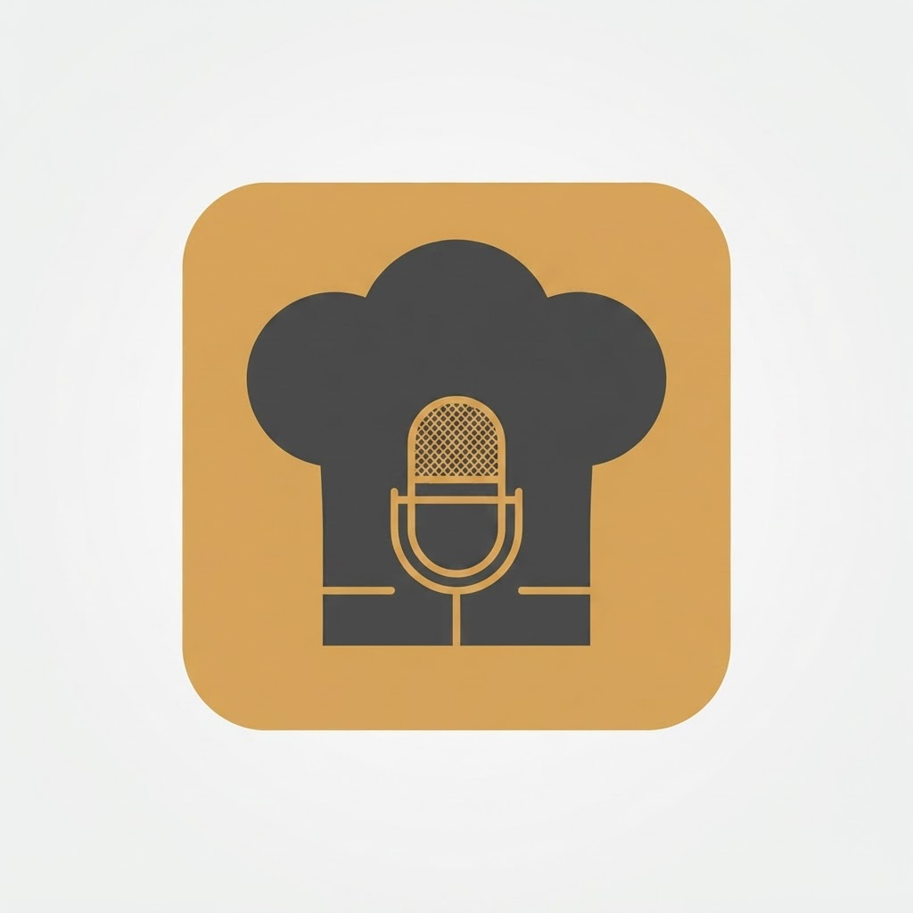

  

<h1 align="center">SayChef</h1>

  <strong>Speak your recipes. We'll organize the rest.</strong>

  🌐 <a href="https://saychef.online">https://saychef.online</a>

---

SayChef is a voice-first AI recipe manager that transforms spoken recipes into beautifully organized cookbooks.

Whether you're preserving family recipes, discovering meals from ingredients you already have, or cooking hands-free, SayChef makes cooking simpler.

---

# Screenshots

| Homepage | Voice Recipe Recorder |
|-----------|-----------------------|
|  |  |

| Ingredient Finder | Shared Family Cookbook |
|-------------------|------------------------|
|  |  |

| Hands-Free Cook Mode | Grocery List |
|----------------------|--------------|
|  |  |

---

# SEO Pages

🎙️ **Voice Recipe Recorder**  
🥘 **AI Ingredient Finder**  
👨‍👩‍👧 **Shared Family Cookbook**  
✍️ **Handwritten Recipe Organizer**  
🍽️ **Hands-Free Cook Mode**  
🛒 **Smart Grocery Lists**

---

# Why We Built SayChef

Typing recipes while cooking is frustrating.

Family recipes get lost.

Recipe cards fade.

Notes apps become cluttered.

SayChef was built to preserve recipes, simplify cooking, and make it effortless to build a personal cookbook using your voice.

---

# Live App

👉 https://saychef.online

---

# Roadmap

- ✅ Voice recipe recording
- ✅ AI recipe formatting
- ✅ Ingredient finder
- ✅ Shared family cookbook
- ✅ Handwritten recipe organizer
- ✅ Hands-Free Cook Mode
- ✅ Grocery lists
- 🔄 Recipe scaling
- 🔄 Nutrition estimates
- 🔄 Meal planning
- 🔄 AI recipe import

---

# Feedback

We're actively improving SayChef.

If you have suggestions or feature requests, we'd love to hear from you.

Visit:

https://saychef.online

---

# License

This repository serves as the public project page for SayChef.

The SayChef application itself is proprietary software.

© 2026 SayChef. All rights reserved.
